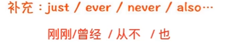
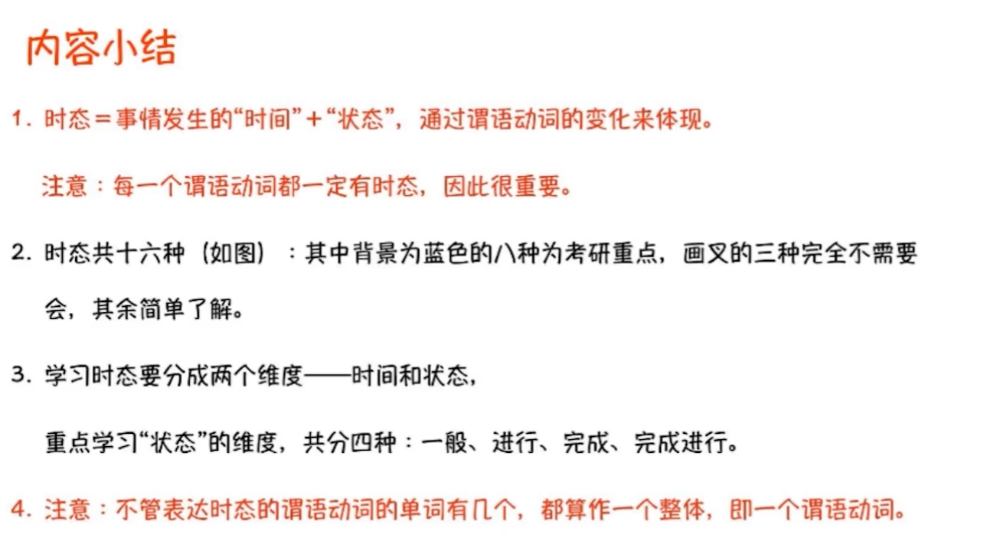
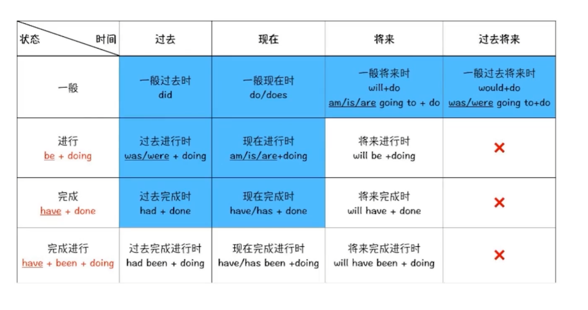

| 态时     | 过去 | 现在 | 将来 | 过去将来 |
| -------- | ---- | ---- | ---- | -------- |
| 一般     | 1    | 1    | 1    | 1        |
| 进行     | 1    | 1    | 2    | 2        |
| 完成     | 1    | 1    | 2    | 2        |
| 完成进行 | 2    | 2    | 2    | 2        |

1为要考，2为不考

1.一般时态

- 一般过去时  : did
- 一般现在时 ： do / does
- 一般将来时： will do / be going to do 
- 一般过将来时： would do   was/were going to do

2.进行时态

- 过去进行时：was/were doing
- 现在进行时：am/is/are doing

3.完成时态

- 过去完成时：had done

  - eg：Throughout the evening, one man had been particularly talkative ...

- 现在完成时：have/has done

  - eg: Since 2000, drought and insects have killed over 100 million trees in California

  - 补充点1：可以搭配到完成时态的中间，表示强调

  

    - eg: "brain drain" has long bothered policymakers in poor countries

  - 补充点2：完成时态完成了时间点的跨越

- 重要区别：

  - 过去完成时和一般过去时：

    - 相同点：表示过去

    - 不同点：

      - 一般过去时：表示过去

      - 过去完成时：表示过去的之前

4. 完成进行时
   - 过去完成进行时：had been doing
   - 现在完成进行时：have/has been doing
   - 将来完成进行时：will have been doing

- 考场攻略

